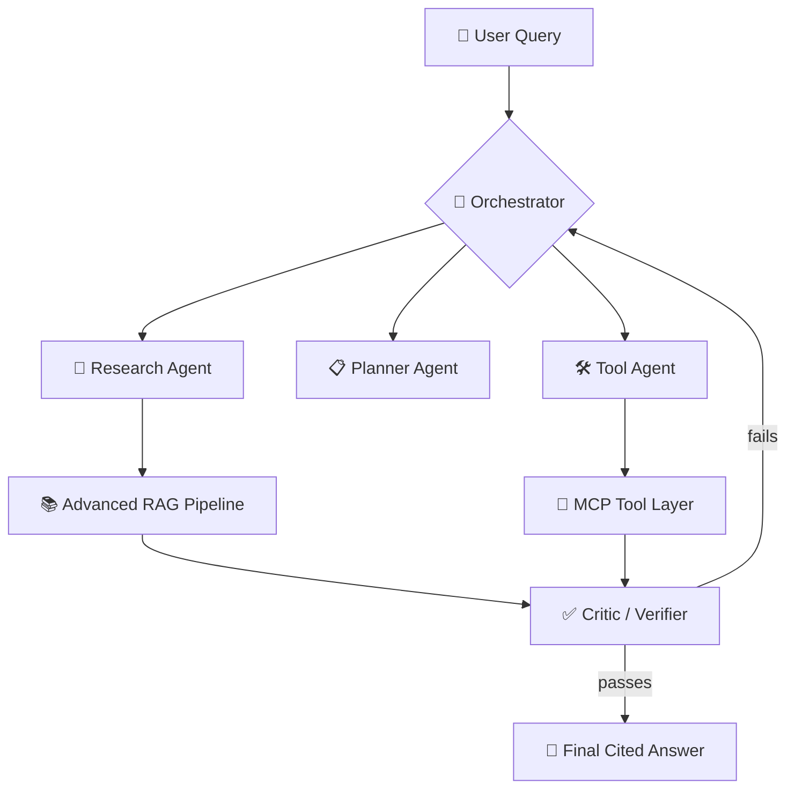

<div align="center">

# 🧠 Agentic RAG Engine

### A Verified, Self-Correcting, Action-Capable Knowledge System for Autonomous Knowledge Work

*Expert-level Retrieval-Augmented Generation fused with expert-level multi-agent orchestration.*

[](#-build-progress)
[](#-build-progress)
[](#-license)
[](#-tech-stack)
[](#-mcp-tool-layer)

<br/>

<table>
<tr>
<td align="center"><b>2</b><br/><sub>systems fused: RAG + agents</sub></td>
<td align="center"><b>3</b><br/><sub>MCP servers tracked</sub></td>
<td align="center"><b>6+</b><br/><sub>evaluation metrics</sub></td>
<td align="center"><b>7</b><br/><sub>build phases</sub></td>
</tr>
</table>

</div>

---

## 📖 Table of Contents

- [Motivation](#-motivation)
- [What "Expert-Level" Means Here](#-what-expert-level-means-here)
- [System Architecture](#-system-architecture)
- [Shared Agent State](#-shared-agent-state)
- [MCP Tool Layer](#-mcp-tool-layer)
- [Human-in-the-Loop Safety](#-human-in-the-loop-safety)
- [Memory](#-memory)
- [Evaluation Plan](#-evaluation-plan)
- [Minimum Viable Feature Set](#-minimum-viable-feature-set)
- [Tech Stack](#-tech-stack)
- [Learning Objectives](#-learning-objectives)
- [Build Progress](#-build-progress)
- [Deliverables](#-expected-deliverables)
- [License](#-license)

---

## 💡 Motivation

Most public RAG and agentic AI projects share the same shape: chunk → embed → store → retrieve by cosine similarity → hand to an LLM. That pattern is the **baseline**, not the ceiling.

Two gaps motivate this project:

> **🔍 The RAG gap** — Naive retrieval degrades badly on multi-hop, ambiguous, or oddly-phrased queries. It has no mechanism to notice when retrieval has failed, and no verifiable link between an answer and its evidence.

> **🤖 The Agentic gap** — Most "agentic" demos are a single LLM call in a `while` loop, with no explicit state, no error recovery, no tool discovery, and no safeguards on consequential actions.

**Agentic RAG Engine** closes both gaps in *one coherent system*, so the RAG subsystem and the agent subsystem reinforce each other instead of being two disconnected demos glued together.

> **The one-sentence test this project is built to pass:** if you removed the RAG subsystem, would this still be an interesting agentic system? If you removed the agents, would the RAG subsystem still be interesting on its own? **Both answers have to be yes.**

---

## 🚀 What "Expert-Level" Means Here

### Retrieval-Augmented Generation

| Capability | ❌ Basic RAG | ✅ Agentic RAG Engine |
|---|---|---|
| Retrieval method | Dense embeddings only | Hybrid: BM25 + dense, fused by reciprocal rank fusion |
| Result quality control | Top-k passed directly to the LLM | Retrieve top-30 → cross-encoder reranker narrows to top-5 |
| Query handling | Single query, verbatim | Query decomposition + query rewriting |
| Chunking | Fixed-size splitting | Semantic / parent-child chunking |
| Filtering | None | Metadata-aware filtering (date, source, department, access) |
| Context handling | Retrieved text used as-is | Context compression before it reaches the LLM |
| Failure handling | Silent — bad retrieval → bad answer | Self-grading retrieval loop: rewrite and retry on failure |
| Trustworthiness | No link between answer and source | Citation verification against retrieved chunks |
| Evaluation | None, judged by eye | RAGAS-style metrics, measured and logged |

### Agentic AI

| Capability | ❌ Basic Agent | ✅ Agentic RAG Engine |
|---|---|---|
| Control flow | Single LLM call in a loop | Explicit multi-agent graph: orchestrator, research, planner, tool, critic |
| State | Implicit, in prompt history | Explicit shared state object (task, plan, evidence, tool results, errors, confidence) |
| Tool use | One or two hardcoded functions | MCP tool layer with dynamically discovered tools across custom servers |
| Error handling | Crashes or hallucinates | Retry, fallback tool selection, or escalation to replanning |
| Self-checking | None; first answer is final | Critic/verifier agent gates the final answer; failure triggers replan |
| Action safety | All actions execute automatically | Risk-classified actions; destructive actions need human approval |
| Memory | None, or single-session only | Episodic memory (past sessions) + semantic memory (durable facts) |
| Observability | None | Full tracing of decisions, tool calls, and retries |

---

## 🏗 System Architecture

A user query enters through an **orchestrator agent**, which routes it to a **research agent** (query decomposition + retrieval), a **planner agent** (multi-step execution planning), and a **tool agent** (execution via MCP). Retrieval flows through the advanced RAG pipeline; actions flow through the MCP tool layer. Both converge on a **critic/verifier agent**, which checks groundedness and citation quality before returning a final, cited answer. On failure, the critic triggers a **replan loop** instead of returning an unverified answer.



---

## 🧩 Shared Agent State

Using an **explicit, typed state object** — rather than passing raw conversation history between agents — is the single detail that most distinguishes real agent engineering from a prompt-chaining script.

```python
class AgentState:
    task: str
    plan: list
    sub_questions: list
    evidence: list
    tool_results: list
    intermediate_results: list
    errors: list
    confidence: float
    final_answer: str
```

---

## 🔌 MCP Tool Layer

Rather than consuming a single pre-built MCP integration, this project builds **1–3 custom MCP servers** exposing real tools (`search_documents`, `run_sql`, `get_github_issue`, `create_issue`, …). The tool agent **dynamically discovers** available tools at runtime and selects among them — no hardcoded function calls.

---

## 🛡 Human-in-the-Loop Safety

| Action type | Behavior |
|---|---|
| 🟢 Read-only (search, query, lookup) | Executes automatically |
| 🔴 Destructive (create / modify / send) | Requires risk assessment + explicit human approval before execution |

---

## 🧠 Memory

- **Episodic memory** — record of past queries, actions taken, and outcomes.
- **Semantic memory** — durable facts the system has accumulated over time.

---

## 📊 Evaluation Plan

Unfinished or unmeasured agent projects are the norm — this one is explicitly scoped to produce **numbers**, not just a demo.

| Metric | What it measures |
|---|---|
| **Groundedness** | Whether claims in the answer are supported by retrieved evidence |
| **Retrieval recall** | Whether the relevant chunks were retrieved at all |
| **Answer accuracy** | Whether the final answer is correct against a labelled benchmark |
| **Tool success rate** | Fraction of tool calls completing without error or retry |
| **Citation accuracy** | Whether cited sources actually support the claims attached to them |
| **Latency & cost** | Average response time and token cost per query |

**Controlled experiment:** Naive RAG → Hybrid RAG → Agentic RAG → Agentic + Reranker, compared on faithfulness, context precision, and answer relevance. A lightweight results **dashboard** summarizes all metrics in the final deliverable.

---

## ✅ Minimum Viable Feature Set

<details open>
<summary><b>🔴 Must have</b> — project is incomplete without these</summary>
<br/>

- [ ] Hybrid retrieval (BM25 + dense) with reranking
- [ ] Query decomposition and rewriting
- [ ] Multi-agent graph with explicit shared state (LangGraph or equivalent)
- [ ] At least one custom MCP server with dynamically discovered tools
- [ ] Critic/verifier agent with a working replan loop
- [ ] Human-in-the-loop approval on at least one destructive action
- [ ] Evaluation harness: naive vs. hybrid vs. agentic comparison

</details>

<details>
<summary><b>🟡 Should have</b> — strengthens the project, not blocking</summary>
<br/>

- [ ] Episodic and semantic memory layer
- [ ] Results dashboard (metrics table or simple UI)
- [ ] Metadata-aware filtering and context compression

</details>

<details>
<summary><b>🟢 Nice to have</b> — stretch goals, time permitting</summary>
<br/>

- [ ] Multiple MCP servers spanning distinct domains (code, data, communication)
- [ ] Written failure-mode analysis
- [ ] Small demo front end beyond a CLI or notebook

</details>

---

## 🧰 Tech Stack

| Layer | Tooling |
|---|---|
| **Orchestration** | LangGraph / LangChain — multi-agent state graph |
| **Retrieval** | Qdrant / Weaviate, BM25 index, cross-encoder reranker |
| **Tool integration** | Model Context Protocol (MCP) — custom servers + MCP client |
| **Evaluation** | RAGAS or equivalent custom evaluation harness |
| **Observability** | LangSmith / Langfuse or equivalent |
| **Backend** | FastAPI |
| **Model access** | OpenRouter or equivalent LLM API |

---

## 🎓 Learning Objectives

1. **Advanced retrieval engineering** — hybrid search, reranking, query decomposition/rewriting.
2. **Multi-agent system design** — explicit state management, conditional graph routing, agent-to-agent handoff.
3. **Tool-use & protocol design** — building and exposing tools via MCP, dynamic tool discovery/selection.
4. **Self-correcting systems** — critic → replan feedback loops instead of one-shot generation.
5. **AI safety & governance in practice** — risk classification and human-in-the-loop gating.
6. **Memory system design** — episodic vs. semantic memory, how each is retrieved and used.
7. **Rigorous evaluation** — building a harness and running controlled comparisons, not eyeballing output.
8. **Systems thinking under scope constraints** — shipping a finished, measured system over an unfinished ambitious one.

---

## 🛠 Build Progress

> 🚧 **This project is actively in progress.** Currently on **Phase 1: Naive RAG baseline + evaluation harness.**

| Phase | Description | Status |
|:---:|---|:---:|
| 1 | Naive RAG baseline + evaluation harness | 🟡 In Progress |
| 2 | Hybrid retrieval + reranking | ⚪ Not Started |
| 3 | Multi-agent loop (LangGraph) | ⚪ Not Started |
| 4 | Custom MCP server + tool agent | ⚪ Not Started |
| 5 | Human-in-the-loop approval gate | ⚪ Not Started |
| 6 | Memory layer (episodic + semantic) | ⚪ Not Started |
| 7 | Dashboard + evaluation writeup | ⚪ Not Started |

```
Progress ▓▓░░░░░░░░░░░░░░░░░░░░  1 / 7 phases
```

---

## 📦 Expected Deliverables

- ✅ A working, deployed (or locally runnable) multi-agent RAG system meeting the [Minimum Viable Feature Set](#-minimum-viable-feature-set)
- ✅ A public code repository with a README containing the architecture diagram, evaluation table, and a documented failure-mode section
- ✅ An evaluation report comparing naive RAG, hybrid RAG, and agentic RAG on the same benchmark queries
- ✅ A short demo (recorded or live) showing the system handling a multi-hop query end-to-end, including a human-in-the-loop approval step

---

## 📄 License

This project is licensed under the [MIT License](LICENSE).

<div align="center">

---

Built by **[Subhan Azhar](https://github.com/SubhanSandhu312)** · Software Engineering, Institute of Space Technology (IST)

[](https://github.com/SubhanSandhu312)
[](https://www.linkedin.com/in/subhan-azhar/)

</div>
